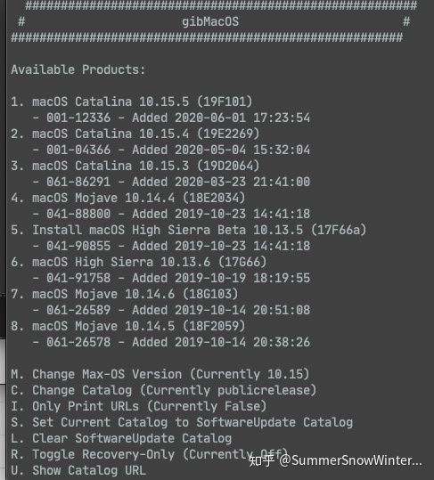
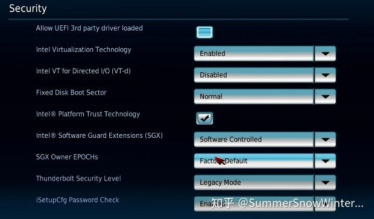
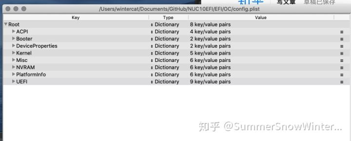
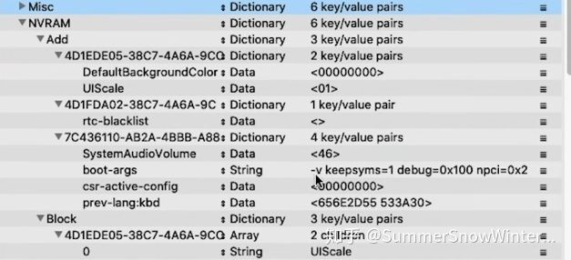

# DgOpenCore

本教程使用**OpenCore0.5.9** 以及**MacOS** **Catalina10.15.5**作为镜像安装。

本教程暂时使用**MacOs**作为启动盘制作教程 ，基于Windows上制作启动盘的方法可以在下留言。

1. 需要准备一个U盘，容量最好16G以上。
2. 下载**[OpenCore0.5.9](https://link.zhihu.com/?target=https%3A//github.com/acidanthera/OpenCorePkg/releases)** 选择[OpenCore-0.5.9-DEBUG.zip](https://link.zhihu.com/?target=https%3A//github.com/acidanthera/OpenCorePkg/releases/download/0.5.9/OpenCore-0.5.9-DEBUG.zip) 或者 [OpenCore-0.5.9-RELEASE.zip](https://link.zhihu.com/?target=https%3A//github.com/acidanthera/OpenCorePkg/releases/download/0.5.9/OpenCore-0.5.9-RELEASE.zip) Debug版本的报错信息更为详细，如果没有需要这类信息可以使用RELEASE
3. 下载**[GibMacOS](https://link.zhihu.com/?target=https%3A//github.com/corpnewt/gibMacOS)** ---下载苹果系统镜像
4. 下载**[NUC10所需要的EFI文件](https://link.zhihu.com/?target=https%3A//github.com/SummerSnowWinterCat/NUC10EFI)** ---启动盘所需要的EFI文件
5. 下载**[MountEFI](https://link.zhihu.com/?target=https%3A//github.com/corpnewt/MountEFI)**   ----打开隐藏的EFI盘
6. 下载**[ProperTree](https://link.zhihu.com/?target=https%3A//github.com/corpnewt/ProperTree)** ----修改plist文件
7. 下载**[GenSMBIOS](https://link.zhihu.com/?target=https%3A//github.com/corpnewt/GenSMBIOS)** ----生成MAC型号以及序列号
8. **[额外的蓝牙驱动](https://link.zhihu.com/?target=https%3A//github.com/SummerSnowWinterCat/NUC10EFI/tree/master/hackintosh%20tools)** 如果驱动出现问题 可以下载并且导入kext

安装步骤

1. 打开GibMacOS里的gitMacOS.command 选择macOS的版本，如果是catalina10.15.5就是选择 **1** 然后回车，自动开始下载。。。。

gitMacOS

2.下载完成后，运行**BuildmacOSInstallApp.command** 然后添加刚刚下载MACOS镜像的路径到这里。从**gitMacOS**里面找到**Catalina**或者是别的镜像，把文件夹拖至此处，按回车。

BuildMacOs

然后就可以发现镜像文件夹里面出现了一个**Install macOS** xxx的文件。

macos install

3.使用**Mac**自带的**DiskUtility**软件格式化U盘

名称改成英文

4.格式化完成后，打开命令行输入

```as3
sudo macos的路径/Contents/Resources/createinstallmedia --volume /Volumes/U盘的名称
```

macos路径选择刚刚下载好的MacOS文件夹内的Install macOS .app文件 Volumes后面改成自己U盘的命名。

```text
例子：sudo /Applications/Install\ macOS\ Catalina.app/Contents/Resources/createinstallmedia --volume /Volumes/MyVolume
```

这一行不要复制，作为参考！

回车后输入**Y**进行镜像导入 等待完成。。。需要蛮久的时间，具体时间得看U盘的速度

5.使用**MountEFI**打开隐藏分区**EFI**

MountEFI

选择安装好后的U盘盘符 并输入数字，即可打开隐藏分区。

6.打开finder访达找到efi盘，将NUC10EFI文件夹整个移动到里面即可

7.接下来修改**BIOS**，启动**NUC10**进入BIOS界面

Advanced

Onboard Devices

Security

SecureBoot

Boot

Boot的地方选择要启动的U盘为第一个Option

去除FastBoot

Boot

8.按下**F10**保存并退出，启动U盘的引导

9.没出问题的话，即可开始安装MACOS

10.安装完以后，使用**MountEFI**打开安装好后的盘符里的**EFI**，打开**EFI**盘符，将U盘里的EFI文件夹拖至系统的EFI里。

11.打开[GenSMBIOS](https://link.zhihu.com/?target=https%3A//github.com/corpnewt/GenSMBIOS) ，运行**GenSMBIOS.command** 

GenSMBIOS

先选择 1 安装**MacSerial** 然后选择 2 把系统EFI里 OC文件夹内的Config.plist拖入命令行

选择3 生成虚假机器型号 比如 **MacMini8，1 或者iMac 9，1 等** 然后选择4生产UUID 最后输入5 后 退出关闭命令行

!推荐i5机型使用**MacMini8**，1 i7机型使用iMac 或者MacMini8，1

12.**重启**系统 （如果无法启动，BIOS里选择安装好后的盘符）

13.文章中的**[ProperTree](https://link.zhihu.com/?target=https%3A//github.com/corpnewt/ProperTree) 是**用来无损修改plist的程序，如果需要消除启动时候会显示的命令代码，可以用**ProperTree**来修改plist。

open

plist

去除启动时候的额外信息

**boot-args** 去除**-v** 即可消除启动时候的信息，更完美的模拟苹果电脑进入系统的感觉。

记得按**command+s**进行保存后，重启系统

【如有什么问题 可以在下面提问！】

